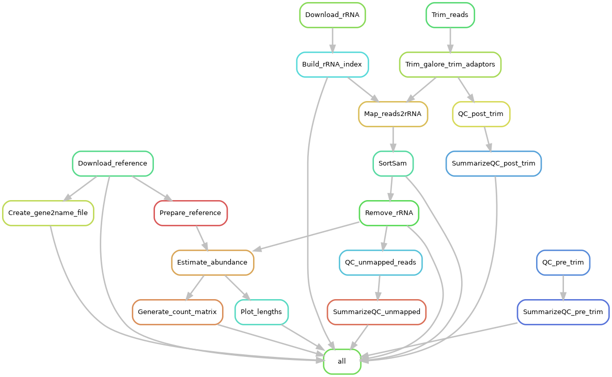

# Snakemake workflow: Reference-based transcriptomics

This repository contains a snakemake pipeline for performing reference based transcriptomics using established tools and pipelines. Please do not forget to cite the authors of the tools used.

- FastQC : quality check reads before and after trimming
- MultiQC: summarize FastQC and samtools reports
- Trimmomatic: quality trim reads
- Bowtie2: map high quality reads to the genome
- RSEM: Gene counting and count table generation
- Samtools: for generating mapping statistics

## Authors

* Olabiyi Obayomi (@olabiyi)

## Usage

If you use this workflow in a paper, don't forget to give credits to the authors by citing the URL of this (original) repository and, if available, its DOI (see above).

It was tested with single-end transcriptomics fastq files. The reference genome fasta and gtf files were downloaded from NCBI.

### Step 1: Obtain a copy of this workflow

1. git clone https://github.com/olabiyi/snakemake-workflow-reference-based-transcriptomics.git

### Step 2: Configure workflow

Configure the workflow according to your needs by editing the files in the `config/` folder. Adjust `config.yaml` to configure the workflow execution, and `samples.tsv` to specify your sample setup. Make sure your sample.tsv file does not contain any error as this could lead to potentially losing all of your data when renaming the files.

### Step 3: Install Snakemake (optional)

Install Snakemake using [conda](https://conda.io/projects/conda/en/latest/user-guide/install/index.html):

    conda create -c bioconda -c conda-forge -n snakemake snakemake

For installation details, see the [instructions in the Snakemake documentation](https://snakemake.readthedocs.io/en/stable/getting_started/installation.html).

### Step 4: Install non_model_RNA_Seq environment (Optional)
If you would like to use the same enviroment the pipeine was tested in
	conda env create -f envs/non_model_RNA_Seq.yaml  

### Step 4: Execute workflow
conda activate snakemake
snakemake -pr --keep-going --rerun-incomplete --restart-times 3 --cores 14
